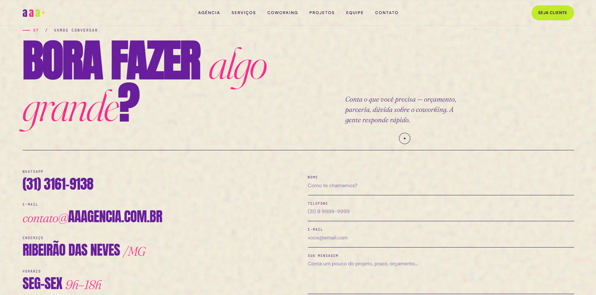
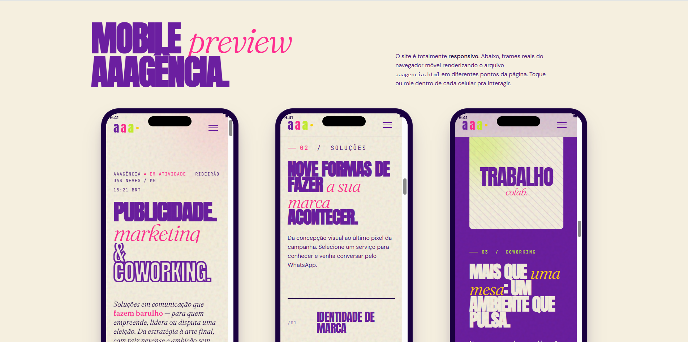

# 🚀 Protótipo AAAgência - Landing Page

Este projeto consiste numa remodelação de alta fidelidade e responsiva do site da **AAAgência**. O foco principal foi modernizar a interface (UI) e a experiência do utilizador (UX), implementando uma nova tipografia ousada e mantendo a identidade visual vibrante da marca, com layouts adaptados tanto para desktop quanto para dispositivos móveis.

## 📸 Preview

### Visão Desktop (Seção de Contato)

### Visão Mobile (Responsividade)

## ✨ Funcionalidades
- **Design Tipográfico Ousado:** Contraste forte entre fontes blocky (pesadas) e fontes serifadas em itálico, criando uma hierarquia visual moderna.
- **Identidade Visual Fiel:** Uso estratégico das cores institucionais (Roxo Profundo, Rosa Choque e Verde Limão) sobre um fundo *off-white* para não cansar a vista.
- **Responsividade Total (Mobile-First):** Estrutura 100% adaptável para smartphones, garantindo leitura fluida e navegação intuitiva em telas menores.
- **Formulário de Contato Limpo:** Interface minimalista focada na conversão e facilidade de preenchimento.

## 🛠️ Tecnologias Utilizadas
- **HTML5:** Estrutura semântica do projeto.
- **Tailwind CSS:** Estilização ágil via classes utilitárias, permitindo prototipagem rápida e design responsivo.
- **CSS Customizado:** Ajustes finos de tipografia e espaçamentos.

## 🚀 Como Executar o Projeto

1. Clone este repositório ou faça o download dos arquivos.
2. Certifique-se de que todas as imagens (como `ladingpage.jpg` e `modelomobile.jpg`) estejam no diretório correto.
3. Abra o arquivo `index.html` diretamente em qualquer navegador moderno (Chrome, Edge, Firefox, Safari).
4. *Dica:* Se estiver usando o VS Code, utilize a extensão **Live Server** para visualizar as alterações em tempo real.

---
Desenvolvido por **Henrique Bruno**.
🚀 Protótipo AAAgência - Landing Page
Este projeto consiste numa remodelação de alta fidelidade da página inicial da AAAgência. O objetivo foi modernizar a interface (UI) e a experiência do utilizador (UX), mantendo a identidade visual vibrante e a paleta de cores original.

✨ Funcionalidades
Design Moderno: Utilização de sombras, arredondamentos (border-radius) e espaçamentos otimizados.

Identidade Fiel: Aplicação rigorosa das cores Roxo Profundo, Verde Limão e Rosa Choque.

Responsividade: Estrutura adaptável para dispositivos móveis e desktops.

Componentes Reutilizáveis: Construído com Tailwind CSS para facilitar a manutenção.

🛠️ Tecnologias Utilizadas
HTML5: Estrutura semântica.

Tailwind CSS: Estilização via classes utilitárias e CDN.

Google Fonts: Tipografia "Poppins" para um aspeto profissional.

Font Awesome: Ícones sociais e de navegação.

🚀 Como Executar o Projeto
Copia o código do ficheiro index.html.

Cria um novo ficheiro no teu computador chamado index.html.

Cola o código e guarda o ficheiro.

Abre o ficheiro em qualquer navegador (Chrome, Edge, Firefox).

Nota: É necessária ligação à internet para carregar o Tailwind CSS e as fontes externas.

Desenvolvido por Henrique Bruno.
